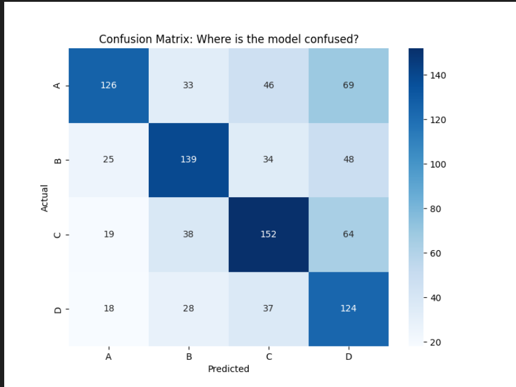

========================================
📊 RAG SYSTEM DIAGNOSTICS
========================================

✅ Overall Accuracy: 54.10%

🔍 Accuracy by Category:
                                 mean  count
category
Acute Right Heart Failure    0.000000      1
Anemia                       0.000000      1
Complication: Mechanism    100.000000      1
Contraindication           100.000000      1
Diagnosis                   52.480418    383
Herpesviridae              100.000000      1
Jaundice                     0.000000      1
Lisinopril                   0.000000      1
Mechanism                   50.980392    306
Prevention                  50.000000      2
Screening                   50.000000      2
Sensitivity                  0.000000      1
Prevention                  50.000000      2
Screening                   50.000000      2
Sensitivity                  0.000000      1
Screening                   50.000000      2
Sensitivity                  0.000000      1
Sensitivity                  0.000000      1
Septicemia                 100.000000      1
Spontaneous Abortion       100.000000      1
Treatment                   59.595960    297

⚠️ 'Unknown' Parsing Errors: 0 (0.0%)

📉 Confusion matrix saved to 'confusion_matrix.png'

📏 Accuracy by Reasoning Length (Quartiles):
d:\win_sem_25\RAG_agents\analysis\1000Q_v2_analysis.py:55: FutureWarning: The default of observed=False is deprecated and will be changed to T

📏 Accuracy by Reasoning Length (Quartiles):
d:\win_sem_25\RAG_agents\analysis\1000Q_v2_analysis.py:55: FutureWarning: The default of observed=False is deprecated and will be changed to T📏 Accuracy by Reasoning Length (Quartiles):
d:\win_sem_25\RAG_agents\analysis\1000Q_v2_analysis.py:55: FutureWarning: The default of observed=False is deprecated and will be changed to Td:\win_sem_25\RAG_agents\analysis\1000Q_v2_analysis.py:55: FutureWarning: The default of observed=False is deprecated and will be changed to True in a future version of pandas. Pass observed=False to retain current behavior or observed=True to adopt the future default and silence thirue in a future version of pandas. Pass observed=False to retain current behavior or observed=True to adopt the future default and silence this warning.
  print(df.groupby('len_quartile')['is_correct'].mean() * 100)
len_quartile
len_quartile
len_quartile
Short        63.888889
Medium       51.587302
Long         51.219512
Very Long    49.600000
Name: is_correct, dtype: float64

