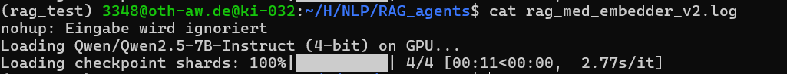

## current training
* evaluate the search plan and context relevant for further improvement.

* retrieve more pages from search plan, and rerank for more relevant pages. 

## Next training
* not using the train split yet.

* embedder finetuning on train split - pritamdeka/S-PubMedBert-MS-MARCO

* compare the Qwen3-0.6B with Qwen2.5-7B performance
to reduce GPU cost

* integrate the self-consistency to pipeline(majority voting)

## history 
* GPU 32 embedder 1000q

* GPU 32 - 30q with source tracking
analysis - not fully using the 5 pages of Wiki, mostly using 1 or 2 pages.

improvement - try to integrate the options in search query, try to use 5 pages of input, as much useful info as possible.

* rag_full wiki (try to use 5 pages of relevant infomation) plus hybrid retriever on the wiki context
get 60% correct rate on 1000 Questions.